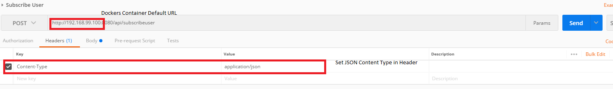
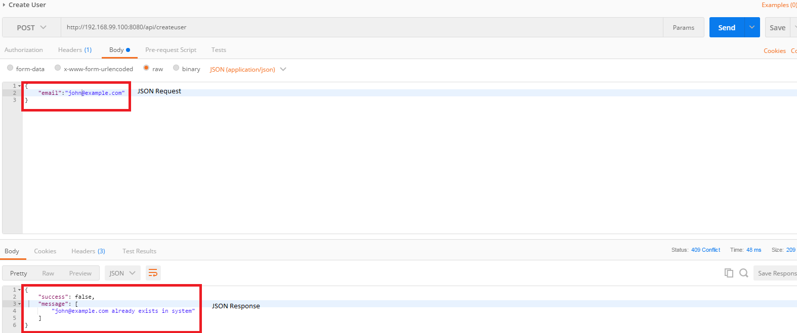

## Friend Management Rest API

### Background

For any application with a need to build its own social network, "Friends Management" is a common requirement
which usually starts off simple but can grow in complexity depending on the application's use case.

Usually, applications would start with features like "Friend", "Unfriend", "Block", "Receive Updates" etc.

#### How to Build and Run

We need docker-compose to build and run the project:

In the folder docker, we can see the file docker-compose.yml and two folders:friends and mysql. The service of friends depends on mysql.

The Dockerfile file in the folder of mysql is to build a MySQL container which provides Database Service.It will create a database named friends and init the database using setup.sql when building.<br>

The Dockerfile file in the folder of friends is to build a Docker container which provides Web Service. The jar file for the application could be generated from local maven build or from maven docker file (Takes much longer to generate due to downloading of dependencies in container).

Steps
1) Build REST API jar file based on pom.xml
2) Download Dockers (https://docs.docker.com/docker-for-windows/install/). 
If Windows 7 and below use Dockers ToolBox (https://www.docker.com/products/docker-toolbox).
3) Run Docker Composer: docker-compose up -d

### How to Test
1) Download Postman (https://www.getpostman.com/postman)
2) Key in URL along with the API request as well as setting the header to cater to JSON Content Type Request



3) Key in JSON Request Body (select Raw option in radio button) and click on Send



#### User Stories

**1. As a user, I need an API to create a user account.**

The API should receive the following JSON request: /api/createuser

```
{
    "email":"andy@example.com"
  
}
```

The API should return the following JSON response on success:

```
{
    "success": true
}
```

The API should return the following JSON response when email already exists
```
{
    "success": false,
    "message": [
        "andy@example.com already exists in system"
    ]
}
```

**2. As a user, I need an API to create a friend connection between two email addresses.**

The API should receive the following JSON request: /api/connectuser

```
{
  friends:
    [
      "andy@example.com",
      "john@example.com"
      
    ]
}
```

The API should return the following JSON response on success:

```
{
    "success": true
}
```

The API should return the following JSON response if one of the email does not exists.

```
{
    "success": false,
    "message": [
        "andy@example.com does not exist in system"
    ]
}
```

The API should return the following JSON response if one email has blocked another email.

```
{
    "success": false,
    "message": [
        "andy@example.com and john@example.com are not allowed to be connected"
    ]
}
```

The API should return the following JSON response when connection already exists

```
{
    "success": false,
    "message": [
        "andy@example.com and john@example.com are already connected"
    ]
}
```

**3. As a user, I need an API to retrieve the friends list for an email address.**

The API should receive the following JSON request: /api/getconnection

```
{
    email: 'andy@example.com'
}
```

The API should return the following JSON response on success:

```
{
    "success": true,
    "friends" :
    [
      "john@example.com"
    ],
    "count" : 1   
}
```

The API should return the following JSON response if the email does not exists.

```
{
    "success": false,
    "message": [
        "andy@example.com does not exist in system"
    ]
}
```

**4. As a user, I need an API to retrieve the common friends list between two email addresses.**

The API should receive the following JSON request: /api/getmutualconnection

```
{
  friends:
    [
      'andy@example.com',
      'john@example.com'
    ]
}
```

The API should return the following JSON response on success:

```
{
  "success": true,
  "friends" :
    [
      "common@example.com"
    ],
  "count" : 1   
}
```

The API should return the following JSON response if one of the emails does not exists.

```
{
    "success": false,
    "message": [
        "andy@example.com does not exist in system"
    ]
}
```

**5. As a user, I need an API to subscribe to updates from an email address.**

Please note that "subscribing to updates" is NOT equivalent to "adding a friend connection".

The API should receive the following JSON request: /api/subscribeuser

```
{
  "requestor": "lisa@example.com",
  "target": "john@example.com"
}
```

The API should return the following JSON response on success:

```
{
  "success": true
}
```

The API should return the following JSON response if one of the emails does not exists.

```
{
    "success": false,
    "message": [
        "andy@example.com does not exist in system"
    ]
}
```

The API should return the following JSON response if the email has already subscribed to the other.

```
{
    "success": false,
    "message": [
        "andy@example.com already subscribed to john@example.com"
    ]
}
```

**6. As a user, I need an API to block updates from an email address.**

Suppose "andy@example.com" blocks "john@example.com":

- if they are connected as friends, then "andy" will no longer receive notifications from "john"
- if they are not connected as friends, then no new friends connection can be added

The API should receive the following JSON request: /api/blockuser

```
{
  "requestor": "andy@example.com",
  "target": "john@example.com"
}
```

The API should return the following JSON response on success:

```
{
  "success": true
}
```

The API should return the following JSON response if one of the emails does not exists.

```
{
    "success": false,
    "message": [
        "andy@example.com does not exist in system"
    ]
}
```

The API should return the following JSON response if the email has already subscribed to the other.

```
{
    "success": false,
    "message": [
        "andy@example.com already blocked to john@example.com"
    ]
}
```

**7. As a user, I need an API to retrieve all email addresses that can receive updates from an email address.**

Eligibility for receiving updates from i.e. "john@example.com":
- has not blocked updates from "john@example.com", and
- at least one of the following:
  - has a friend connection with "john@example.com"
  - has subscribed to updates from "john@example.com"
  - has been @mentioned in the update

The API should receive the following JSON request: /api/sendnotification

```
{
  "sender":  "john@example.com",
  "text": "Hello World! kate@example.com"
}
```

The API should return the following JSON response on success:

```
{
  "success": true
  "recipients":
    [
      "lisa@example.com",
      "kate@example.com"
    ]
}
```
The API should return the following JSON response if the sender does not exists.

```
{
    "success": false,
    "message": [
        "john@example.com does not exist in system"
    ]
}
```


